# 🚀 DevPulse — Developer & Repository Analytics Platform

DevPulse is a cloud-native developer and repository analytics platform designed to ingest, process, and index developer activity (commits, pull requests, code reviews, and metrics) from GitHub and GitLab in real-time, providing full-text search and aggregated insights.

---

## 🏗️ System Architecture

```mermaid
flowchart TD
    subgraph Clients["External Clients & VCS Webhooks"]
        GH[GitHub Webhook]
        GL[GitLab Webhook]
        CLI[Postman / Client API]
    end

    subgraph AWS["AWS Cloud (VPC)"]
        subgraph IngressLayer["Ingress & Load Balancing"]
            ALB[AWS Application Load Balancer]
        end

        subgraph EKS["Amazon EKS Cluster"]
            API[DevPulse API - 2 Replicas]
            WRK[DevPulse Worker - 1 Replica]
            RMQ[(RabbitMQ StatefulSet)]
        end

        subgraph DataLayer["Data & Search Layer"]
            RDS[(Amazon RDS PostgreSQL)]
            OS[(Amazon OpenSearch Service)]
        end
    end

    GH -->|X-Hub-Signature-256| ALB
    GL -->|X-Gitlab-Token| ALB
    CLI -->|HTTP REST API| ALB

    ALB -->|Ingress Route| API
    API -->|Read/Write| RDS
    API -->|Publish Events| RMQ
    
    RMQ -->|Consume Webhook & Index Jobs| WRK
    WRK -->|Write Ingested Data| RDS
    WRK -->|Bulk Index Documents| OS
    API -->|Search Queries| OS
```



---

## 🌍 Infrastructure as Code (Terraform)

The entire AWS footprint is codified under [`terraform/`](terraform/) so the platform can be reproduced in any account with a single `terraform apply` — no manual console clicking. The stack was first built by hand from the AWS console, then migrated to Terraform to make it versioned, reviewable, and repeatable.

**Provisioned resources:** VPC (public/private subnets, NAT, EKS subnet tags) · Amazon EKS (managed node group) · Amazon RDS PostgreSQL 16 (Multi-AZ, encrypted, private) · Amazon OpenSearch Service (VPC domain, fine-grained access control) · ECR repositories · security groups scoping RDS/OpenSearch access to the EKS nodes only.

**Design choices:** official `terraform-aws-modules` (VPC/EKS) for battle-tested defaults · remote state in S3 with DynamoDB locking · secrets injected via `TF_VAR_*` (never committed) · least-privilege network isolation. A one-time `bootstrap/` step provisions the state backend, and [`terraform/SETUP.md`](terraform/SETUP.md) walks through a clean deploy into a fresh AWS account.

```bash
cd terraform && terraform init && terraform apply -var-file=example.tfvars
```

---

## 🛠️ Technology Stack

* **Backend & API Layer:** .NET 10 (C# 13), ASP.NET Core Web API, Worker Services, EF Core 10 (Npgsql), Scalar OpenAPI Reference.
* **Database & Persistence:** Amazon RDS (PostgreSQL 16), Npgsql UTC Normalization, Advisory Lock Migration.
* **Message Broker (Event-Driven):** RabbitMQ 3 Management (AMQP & HTTP Protocol), Publisher / Consumer Pattern, Dead Letter Queue (DLQ).
* **Search Engine:** Amazon OpenSearch Service 2.x (Managed, Basic Auth Authentication Mode).
* **Cloud & Infrastructure:** Amazon EKS, AWS ECR, AWS VPC, AWS Application Load Balancer (ALB Controller).
* **Infrastructure as Code:** Terraform (terraform-aws-modules VPC/EKS, S3 + DynamoDB remote state, RDS/OpenSearch/ECR).
* **Containerization & Orchestration:** Docker, Kubernetes Manifests (ConfigMap, Secret, Deployment, StatefulSet, ClusterIP Service, Ingress).
* **CI/CD & Automation:** GitHub Actions, Automated Post-Deploy Node.js E2E Smoke Test Suite.

---

## 📁 Project Structure

```text
devpulse/
├── src/
│   ├── DevPulse.Core/             - Entities, DTOs, Enums, Interfaces, and Settings
│   ├── DevPulse.Infrastructure/   - DbContext, Repositories, OpenSearch & RabbitMQ Integration
│   ├── DevPulse.Api/              - Controllers, Pipeline, OpenApi, Global Exception Handler & Health Checks
│   └── DevPulse.Worker/           - Background Service Host, RabbitMQ Consumers & Index Bootstrapper
├── web/                            - Vue 3 (Vite) SPA dashboard — see web/README section below
├── terraform/                     - Infrastructure as Code (VPC, EKS, RDS, OpenSearch, ECR) + bootstrap & SETUP.md
├── k8s/                           - Kubernetes Manifests (ConfigMap, Secrets, Deployments, StatefulSet)
├── scripts/                       - Automated E2E Smoke Test Script (smoke-test.js)
├── .github/workflows/             - GitHub Actions EKS Deployment Pipeline (deploy.yml)
├── DevPulse.sln                   - .NET Solution File
└── README.md                      - Architecture and Usage Guide
```

---

## 🌐 REST API Endpoints Overview

The API layer exposes 24 endpoints categorized by domain:

### 👤 Users (`/api/users`)
* `GET /api/users` — List developers with pagination and query filtering.
* `GET /api/users/{id}` — Fetch single user details.
* `POST /api/users` — Create new developer profile (BCrypt password hashing).
* `PUT /api/users/{id}` — Update user profile details.
* `DELETE /api/users/{id}` — Deactivate user (Soft delete).
* `GET /api/users/{id}/profile` — Fetch developer profile, associated repositories, and summary metrics.
* `GET /api/users/{id}/metrics` — Fetch aggregated developer activity metrics over time.

### 📦 Repositories (`/api/repositories`)
* `GET /api/repositories` — List monitored repositories.
* `GET /api/repositories/{id}` — Fetch repository details.
* `POST /api/repositories` — Register new repository.
* `PUT /api/repositories/{id}` — Update repository mutable metadata.
* `DELETE /api/repositories/{id}` — Deactivate repository monitoring.
* `GET /api/repositories/{id}/commits` — Fetch repository commit history.
* `GET /api/repositories/{id}/pull-requests` — Fetch repository pull request history.
* `GET /api/repositories/{id}/contributors` — Fetch top contributor leaderboard by commit volume.
* `GET /api/repositories/{id}/metrics` — Fetch aggregate repository metrics.
* `GET /api/repositories/{id}/health-scores` — Fetch code health snapshot history.

### 🔑 Project Tokens (`/api/repositories/{repositoryId}/tokens`)
* `GET /api/repositories/{id}/tokens` — List tokens associated with a repository.
* `POST /api/repositories/{id}/tokens` — Issue GitLab webhook authentication token (One-time plaintext display).
* `DELETE /api/repositories/{id}/tokens/{tokenId}` — Revoke token.

### 📝 Commits & Pull Requests (`/api/commits` & `/api/pull-requests`)
* `GET /api/commits/{id}` — Fetch single commit detail.
* `GET /api/commits/{id}/files` — List files changed by a commit.
* `GET /api/pull-requests/{id}` — Fetch pull request detail.
* `GET /api/pull-requests/{id}/reviews` — List pull request reviews.
* `POST /api/pull-requests/{id}/reviews` — Submit pull request review.
* `GET /api/pull-requests/{id}/comments` — List pull request comments.
* `POST /api/pull-requests/{id}/comments` — Post inline or general comment on pull request.

### 🔍 Search & Webhooks (`/api/search` & `/api/webhooks`)
* `GET /api/search/commits` — Full-text search across commit messages and file paths via OpenSearch.
* `GET /api/search/pull-requests` — Full-text search across PR titles and descriptions via OpenSearch.
* `GET /api/search/reviews` — Full-text search across review comments via OpenSearch.
* `POST /api/search/reindex` — Enqueue asynchronous reindexing job.
* `POST /api/webhooks/github` — Ingest GitHub webhooks with `X-Hub-Signature-256` HMAC validation.
* `POST /api/webhooks/gitlab` — Ingest GitLab webhooks with `X-Gitlab-Token` authentication.

---

## 🔐 Configuration & Environment Variables

Kubernetes environment variables are populated from `ConfigMap` (`devpulse-config`) and `Secret` objects using .NET double-underscore (`__`) syntax:

```yaml
OpenSearch__Endpoint: "https://vpc-devpulse-opensearch-y535mipgihecffjb5l4ehfh6su.us-east-1.es.amazonaws.com"
OpenSearch__AuthMode: "BasicAuth"
OpenSearch__CommitsIndex: "devpulse-commits"
OpenSearch__PullRequestsIndex: "devpulse-pull-requests"
OpenSearch__ReviewsIndex: "devpulse-reviews"
RabbitMq__HostName: "devpulse-rabbitmq"
```

Sensitive credentials are strictly supplied via `k8s/secret.yaml` or AWS Secrets Manager:
* `DatabaseSettings__ConnectionString`
* `OpenSearch__Username` / `OpenSearch__Password`
* `RabbitMq__Username` / `RabbitMq__Password`
* `Webhooks__GitHubSecret`

---

## 💻 Local Development

1. **Spin up local container dependencies:**
```bash
docker run -d --name pg -e POSTGRES_PASSWORD=dev -p 5432:5432 postgres:16
docker run -d --name rmq -p 5672:5672 -p 15672:15672 rabbitmq:3-management
docker run -d --name os -p 9200:9200 -e discovery.type=single-node -e DISABLE_SECURITY_PLUGIN=true opensearchproject/opensearch:2
```

2. **Configure local user-secrets:**
```bash
dotnet user-secrets set "DatabaseSettings:ConnectionString" "Host=localhost;Port=5432;Database=devpulse;Username=postgres;Password=dev" --project src/DevPulse.Api
```

3. **Run the projects:**
```bash
dotnet build DevPulse.sln
dotnet run --project src/DevPulse.Api
dotnet run --project src/DevPulse.Worker
```
* **Scalar API UI:** `http://localhost:5000/scalar/v1`
* **RabbitMQ UI:** `http://localhost:15672` (guest / guest)

---

## 🧪 Automated E2E Smoke Testing

An automated end-to-end smoke test script is provided to validate live cluster health and end-to-end ingestion pipeline:

```bash
node scripts/smoke-test.js
```

The test script automatically verifies health checks, user registration, repository creation, token generation, webhook ingestion, RabbitMQ consumer processing, PostgreSQL database persistence, OpenSearch reindexing, and full-text search querying against the target endpoint.
