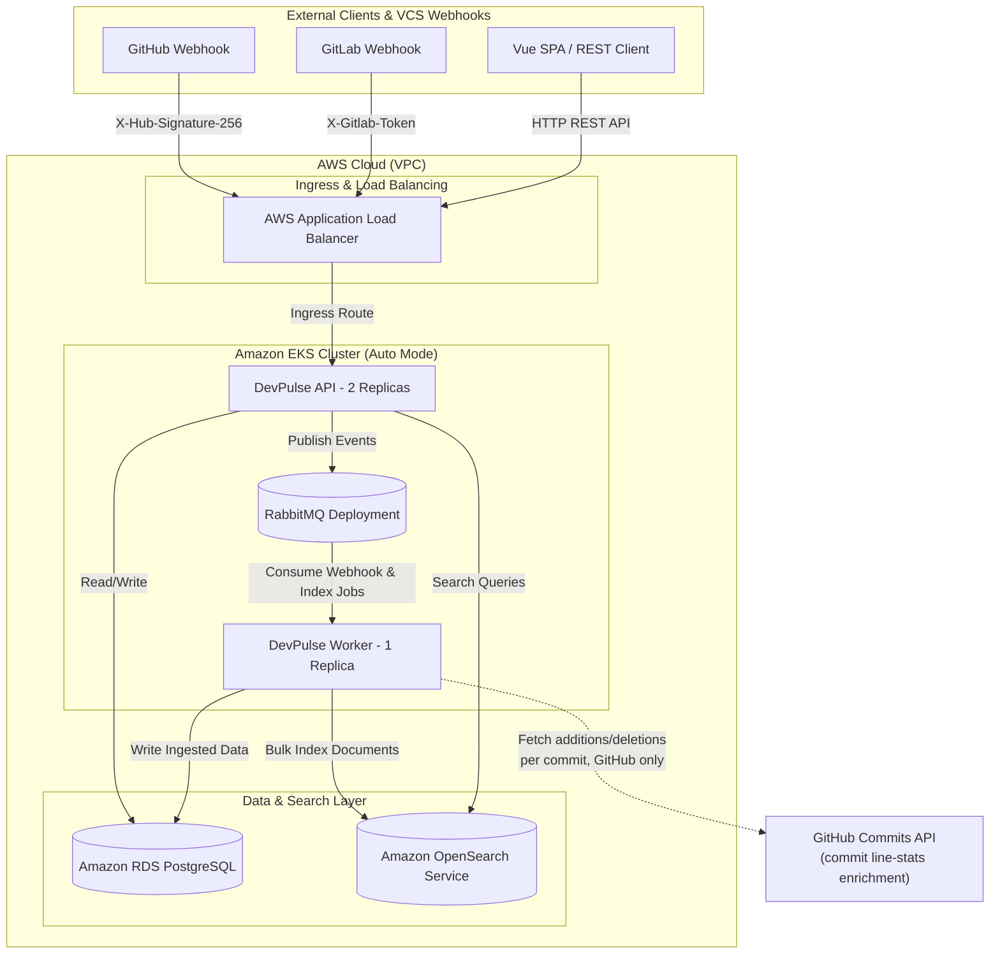

# 🚀 DevPulse — Developer & Repository Analytics Platform

DevPulse is a cloud-native developer and repository analytics platform that
ingests, processes, and indexes developer activity (commits, pull requests,
code reviews, and metrics) from GitHub and GitLab in real time, and exposes
it through a REST API and a Vue single-page dashboard, with full-text search
across everything ingested.

It is built as an event-driven, decoupled system on purpose: a webhook
receiver that only verifies and queues, and a separate worker that does all
the actual writing/indexing — so ingestion never blocks on the database or
search engine, even under bursty push traffic.

> For a narrative account of how this was built — including the production
> incidents encountered on EKS and how they were diagnosed and fixed — see
> [`DEVELOPMENT.md`](DEVELOPMENT.md).

---

## 🏗️ System Architecture



**Why this shape:** the API's only job on the webhook path is signature
verification and enqueueing — it never touches RDS or OpenSearch for a write.
The Worker is the only writer, which means ingestion throughput is bounded by
queue consumption, not by HTTP request latency, and a slow downstream (RDS
failover, OpenSearch under load) degrades queue depth instead of webhook
response times.

---

## 🌍 Infrastructure

The platform runs on Amazon EKS (Auto Mode — AWS provisions and schedules
nodes automatically, no traditional managed node group). The stack:

* **VPC** with 2 public + 2 private subnets across 2 AZs, 1 NAT Gateway for
  private-subnet egress.
* **Amazon EKS** (Auto Mode) running the API, Worker, and RabbitMQ pods —
  scheduled exclusively onto the **private** subnets (see the EKS Auto Mode
  networking incident in `DEVELOPMENT.md` for why this matters and how it
  was enforced).
* **Amazon RDS (PostgreSQL 16)** — private, no public access, security group
  scoped to the EKS node security group only.
* **Amazon OpenSearch Service** — VPC domain, fine-grained access control
  (Basic Auth) plus a domain-level access policy that must independently
  allow the principal (see the 403 incident in `DEVELOPMENT.md`).
* **AWS Application Load Balancer**, provisioned by the EKS Auto Mode ALB
  controller (`ingressClassName: eks-auto-alb`), with the Ingress pinning
  its own public subnets explicitly via
  `alb.ingress.kubernetes.io/subnets` — independent of the cluster's general
  subnet list.
* **Amazon ECR** for the API and Worker container images.

### Infrastructure as Code (Terraform) — status

`terraform/` codifies this stack (VPC, EKS, RDS, OpenSearch, ECR modules) so
it *can* be reproduced from scratch. **As of this writing, it has not been
applied to this AWS account** — there is no `terraform.tfstate` for this
infrastructure; the account's resources were provisioned by hand through the
AWS Console and are managed that way (see `aws-done.md` for the original
manual setup log). Running `terraform apply` today would attempt to create a
parallel stack, not adopt the existing one. Treat the Terraform code as a
blueprint for a fresh account, not as the source of truth for the live one.

```bash
# Only for a brand-new AWS account with no existing DevPulse resources:
cd terraform && terraform init && terraform apply -var-file=example.tfvars
```

---

## 🛠️ Technology Stack

* **Backend & API Layer:** .NET 10 (C# 13), ASP.NET Core Web API, Worker Services, EF Core 10 (Npgsql), Scalar OpenAPI Reference.
* **Frontend:** Vue 3 (Composition API, `<script setup>`), Vite, Vue Router, Pinia, Axios.
* **Database & Persistence:** Amazon RDS (PostgreSQL 16), Npgsql UTC Normalization, Advisory Lock Migration.
* **Message Broker (Event-Driven):** RabbitMQ 3 Management (AMQP & HTTP Protocol), Publisher / Consumer Pattern, Dead Letter Queue (DLQ).
* **Search Engine:** Amazon OpenSearch Service 2.x (Managed, Basic Auth Authentication Mode).
* **Cloud & Infrastructure:** Amazon EKS (Auto Mode), AWS ECR, AWS VPC, AWS Application Load Balancer (ALB Controller).
* **Infrastructure as Code:** Terraform (terraform-aws-modules VPC/EKS, S3 + DynamoDB remote state, RDS/OpenSearch/ECR) — written, not yet applied; see above.
* **Containerization & Orchestration:** Docker, Kubernetes Manifests (ConfigMap, Secret, Deployment, ClusterIP Service, Ingress).
* **CI/CD & Automation:** GitHub Actions, Automated Post-Deploy Node.js E2E Smoke Test Suite.
* **External Integrations:** GitHub Commits API (per-commit line-change stats enrichment, fine-grained PAT, `Contents: Read-only`).

---

## 📁 Project Structure

```text
devpulse/
├── src/
│   ├── DevPulse.Core/             - Entities, DTOs, Enums, Interfaces, and Settings
│   ├── DevPulse.Infrastructure/   - DbContext, Repositories, OpenSearch & RabbitMQ Integration
│   ├── DevPulse.Api/              - Controllers, Pipeline, OpenApi, Global Exception Handler & Health Checks
│   └── DevPulse.Worker/           - Background Service Host, RabbitMQ Consumers & Index Bootstrapper
├── web/                            - Vue 3 (Vite) SPA — dashboard, repository/developer views, search
│   ├── src/api/                    - One client per backend domain, wraps all 24 REST endpoints
│   ├── src/stores/                 - Pinia stores (one per domain)
│   ├── src/modules/                - Feature pages (dashboard, repositories, users, search)
│   ├── src/layouts/                - App shell (sidebar, topbar)
│   └── src/components/common/      - Shared presentational components
├── terraform/                     - Infrastructure as Code (VPC, EKS, RDS, OpenSearch, ECR) — blueprint, not applied (see above)
├── k8s/                           - Kubernetes Manifests (ConfigMap, Secrets, Deployments, Ingress)
├── scripts/                       - Automated E2E Smoke Test Script (smoke-test.js)
├── .github/workflows/             - GitHub Actions EKS Deployment Pipeline (deploy.yml)
├── DevPulse.sln                   - .NET Solution File
├── DEVELOPMENT.md                 - Development journey, incidents, and design rationale
└── README.md                      - This file — architecture and usage guide
```

---

## 🌐 REST API Endpoints Overview

The API layer exposes 24 endpoints categorized by domain:

### 👤 Users (`/api/users`)
* `GET /api/users` — List developers with pagination and query filtering.
* `GET /api/users/{id}` — Fetch single user details.
* `POST /api/users` — Create new developer profile (BCrypt password hashing).
* `PUT /api/users/{id}` — Update user profile details.
* `DELETE /api/users/{id}` — Deactivate user (Soft delete).
* `GET /api/users/{id}/profile` — Fetch developer profile, associated repositories, and summary metrics.
* `GET /api/users/{id}/metrics` — Fetch aggregated developer activity metrics over time.

### 📦 Repositories (`/api/repositories`)
* `GET /api/repositories` — List monitored repositories.
* `GET /api/repositories/{id}` — Fetch repository details.
* `POST /api/repositories` — Register new repository.
* `PUT /api/repositories/{id}` — Update repository mutable metadata.
* `DELETE /api/repositories/{id}` — Deactivate repository monitoring.
* `GET /api/repositories/{id}/commits` — Fetch repository commit history.
* `GET /api/repositories/{id}/pull-requests` — Fetch repository pull request history.
* `GET /api/repositories/{id}/contributors` — Fetch top contributor leaderboard by commit volume.
* `GET /api/repositories/{id}/metrics` — Fetch aggregate repository metrics.
* `GET /api/repositories/{id}/health-scores` — Fetch code health snapshot history.

### 🔑 Project Tokens (`/api/repositories/{repositoryId}/tokens`)
* `GET /api/repositories/{id}/tokens` — List tokens associated with a repository.
* `POST /api/repositories/{id}/tokens` — Issue GitLab webhook authentication token (One-time plaintext display).
* `DELETE /api/repositories/{id}/tokens/{tokenId}` — Revoke token.

### 📝 Commits & Pull Requests (`/api/commits` & `/api/pull-requests`)
* `GET /api/commits/{id}` — Fetch single commit detail.
* `GET /api/commits/{id}/files` — List files changed by a commit.
* `GET /api/pull-requests/{id}` — Fetch pull request detail.
* `GET /api/pull-requests/{id}/reviews` — List pull request reviews.
* `POST /api/pull-requests/{id}/reviews` — Submit pull request review.
* `GET /api/pull-requests/{id}/comments` — List pull request comments.
* `POST /api/pull-requests/{id}/comments` — Post inline or general comment on pull request.

### 🔍 Search & Webhooks (`/api/search` & `/api/webhooks`)
* `GET /api/search/commits` — Full-text search across commit messages and file paths via OpenSearch.
* `GET /api/search/pull-requests` — Full-text search across PR titles and descriptions via OpenSearch.
* `GET /api/search/reviews` — Full-text search across review comments via OpenSearch.
* `POST /api/search/reindex` — Enqueue asynchronous reindexing job.
* `POST /api/webhooks/github` — Ingest GitHub webhooks with `X-Hub-Signature-256` HMAC validation.
* `POST /api/webhooks/gitlab` — Ingest GitLab webhooks with `X-Gitlab-Token` authentication.

All responses are `snake_case` JSON. Paginated list endpoints share one
envelope: `{ total_count, page, page_size, total_pages, items }`.

---

## 🖥️ Frontend

`web/` is a Vue 3 SPA that mirrors the backend's domain split rather than
using a flat `components/` folder — each bounded context (users,
repositories, search, dashboard) owns its own API client, store, and pages.

**Design direction:** developer-tool aesthetic (Grafana / GitHub / Linear) —
dark-first, flat surfaces, sharp corners, monospace for identifiers and
metrics. Deliberately not the gradient/glow/glassmorphism look common to
generic AI-product UIs.

**Pages:** Dashboard (repository overview, service status), Repository
Detail (commits / pull requests / contributors / health score tabs),
Developer Profile (per-developer metrics and repository associations),
Search (scoped full-text search across commits, pull requests, and reviews).

**Structure:**

```text
web/src/
├── api/            - usersApi, repositoriesApi, commitsApi, pullRequestsApi,
│                     searchApi — thin wrappers over the 24 REST endpoints.
│                     http.js also camelizes the backend's snake_case JSON
│                     via an Axios response interceptor, so components never
│                     see the wire format directly.
├── stores/         - Pinia stores, one per domain
├── layouts/         - App shell: sidebar (nav + live service status),
│                      topbar (global search)
├── modules/         - Feature pages, grouped by domain
└── components/common/ - Shared presentational components
    (PanelCard, MetricStat, StatusPill, ProviderBadge)
```

### Running the frontend

```bash
cd web
npm install
npm run dev
```

The dev server **never talks to the backend directly from the browser** —
every `/api/*` request goes through Vite's dev-server proxy
(`server.proxy` in `web/vite.config.js`), which forwards to
`http://localhost:5000`. Point that at a real backend with either:

```bash
# Against the live EKS deployment:
kubectl -n devpulse port-forward svc/devpulse-api 5000:80

# Or a local backend:
dotnet run --project src/DevPulse.Api
```

Set `VITE_API_BASE_URL` (see `web/.env.example`) only if you need to bypass
the proxy entirely — e.g. building for a specific deployed API host. Doing so
requires the backend to send CORS headers for the frontend's origin, which it
does not currently do for arbitrary origins; the dev-server proxy path is the
supported one.

---

## 🔐 Configuration & Environment Variables

Kubernetes environment variables are populated from `ConfigMap` (`devpulse-config`) and `Secret` objects using .NET double-underscore (`__`) syntax:

```yaml
OpenSearch__Endpoint: "https://vpc-devpulse-opensearch-y535mipgihecffjb5l4ehfh6su.us-east-1.es.amazonaws.com"
OpenSearch__AuthMode: "BasicAuth"
OpenSearch__CommitsIndex: "devpulse-commits"
OpenSearch__PullRequestsIndex: "devpulse-pull-requests"
OpenSearch__ReviewsIndex: "devpulse-reviews"
RabbitMq__HostName: "devpulse-rabbitmq"
```

Sensitive credentials are strictly supplied via `k8s/secret.yaml` (git-ignored;
see `k8s/secret.yaml.template` for the shape) or AWS Secrets Manager — never
hardcoded in source:
* `DatabaseSettings__ConnectionString`
* `OpenSearch__Username` / `OpenSearch__Password`
* `RabbitMq__Username` / `RabbitMq__Password`
* `Webhooks__GitHubSecret` — HMAC secret for verifying inbound GitHub webhook signatures.
* `Webhooks__GitHubApiToken` *(optional)* — fine-grained GitHub PAT (`Contents: Read-only` on the connected repo) used solely to fetch per-commit line-change stats after ingestion. Distinct from `GitHubSecret`: that one only verifies inbound signatures and grants no API access. Left unset, commit `additions`/`deletions` stay zero rather than the Worker failing to start.

---

## 💻 Local Development

1. **Spin up local container dependencies:**
```bash
docker run -d --name pg -e POSTGRES_PASSWORD=dev -p 5432:5432 postgres:16
docker run -d --name rmq -p 5672:5672 -p 15672:15672 rabbitmq:3-management
docker run -d --name os -p 9200:9200 -e discovery.type=single-node -e DISABLE_SECURITY_PLUGIN=true opensearchproject/opensearch:2
```

2. **Configure local user-secrets:**
```bash
dotnet user-secrets set "DatabaseSettings:ConnectionString" "Host=localhost;Port=5432;Database=devpulse;Username=postgres;Password=dev" --project src/DevPulse.Api
```

3. **Run the backend:**
```bash
dotnet build DevPulse.sln
dotnet run --project src/DevPulse.Api
dotnet run --project src/DevPulse.Worker
```
* **Scalar API UI:** `http://localhost:5000/scalar/v1`
* **RabbitMQ UI:** `http://localhost:15672` (guest / guest)

4. **Run the frontend** (separate terminal, see [Frontend](#-frontend) above):
```bash
cd web && npm install && npm run dev
```

---

## 🧪 Automated E2E Smoke Testing

An automated end-to-end smoke test script is provided to validate live cluster health and end-to-end ingestion pipeline:

```bash
node scripts/smoke-test.js
```

The test script automatically verifies health checks, user registration, repository creation, token generation, webhook ingestion, RabbitMQ consumer processing, PostgreSQL database persistence, OpenSearch reindexing, and full-text search querying against the target endpoint. It targets the ALB directly (`API_URL` env var, defaulting to the live cluster endpoint) and retries transient `502`/`503`/`504` responses from a freshly-rolled-out pod before treating them as failures.

---

## 📚 Further Reading

* [`DEVELOPMENT.md`](DEVELOPMENT.md) — the development journey: phase-by-phase history, production incidents (OpenSearch access-policy 403, EKS Auto Mode public-subnet scheduling), and the reasoning behind non-obvious decisions.
* [`ILERLEME-RAPORU.md`](ILERLEME-RAPORU.md) — detailed backend architecture notes from the earliest phase (Turkish).
* [`aws-done.md`](aws-done.md) — log of the original manual AWS console setup (Turkish).
* [`terraform/SETUP.md`](terraform/SETUP.md) — clean-account Terraform deployment walkthrough.
